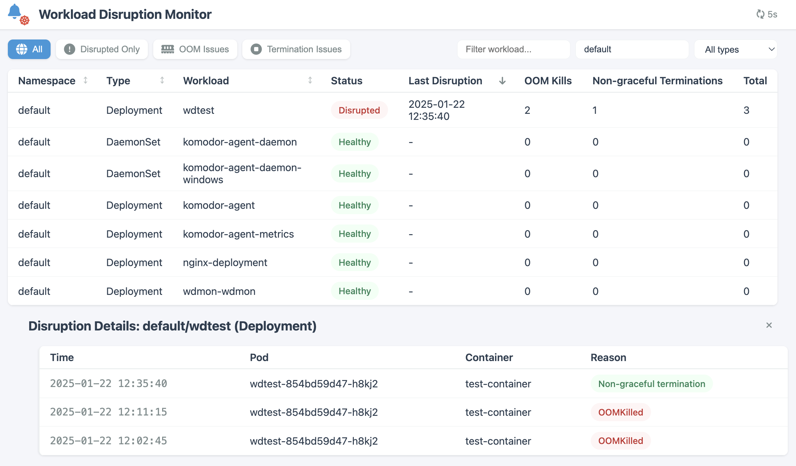

# wdmon - Kubernetes Workload Disruption Monitor

A real-time monitoring tool for Kubernetes workload disruptions, focusing on containers terminated by SIGKILL (exit code 137). It helps identify and distinguish between OOM kills and non-graceful terminations due to grace period expiration.



## Features

- Real-time monitoring of container terminations
- Basic web interface with:
  - View of all workloads (Note: currently xlimited to Deployments in the 'default' namespace), with their disruption statistics, by disruption types (OOM, Non-graceful terminations)
  - Basic filtering, sorting
  - Detailed view of disruption history per workload

## Build and Push

1. Build and push the Docker image:
    ```bash
    # Set your Docker access token
    export DOCKER_PAT=your_docker_access_token
    
    # Build and push with default latest tag
    make all
    
    # Or specify a version
    make all VERSION=1.0.0
    ```
    NOTE: currently hard-coded to 'glikson' docker hub user (and 'wdmon' image)

## Installation

### Using Helm

NOTE: the instructions below assume that glikson/wdmon image is used (can be overriden)

1. Install the chart:
    ```bash
    helm install wdmon ./helm/wdmon
    ```

2. To install in a specific namespace:
    ```bash
    helm install wdmon ./helm/wdmon -n monitoring --create-namespace
    ```

3. To override the image tag:
    ```bash
    helm install wdmon ./helm/wdmon --set image.tag=1.0.0
    ```

### Local

1. Run wdmon (from a shell with configured kubeconfig):
    ```
    python wdmon.py
    ```

## How to test

1. Use the attached wdtest.yaml to run the test Deployment:
    ```
    kubectl create -f wdtest.yaml
    ```

1. Test SIGTERM due to nongraceful termination by terminating the pod created by the Deployment (using kubectl):
    ```
    kubectl delete pod -l app=wdtest
    ```

    Expected output of wdmon (can be ovsered in logs):
    ```
    Container test-container in wdtest-854bd59d47-xb6mv exited with 137 (Error) - likely due to non-graceful termination.
    ```

1. Test SIGTERM due to OOM by triggering memory-intesive logic in the container, by creating a file via executing a 'touch' command:
    ```
    kubectl exec deploy/wdtest -- touch /tmp/oom
    ```

    Expected output of wdmon (can be ovsered in logs):
    ```
    Container test-container in wdtest-854bd59d47-pl8qz exited with 137 (OOMKilled).
    ```
